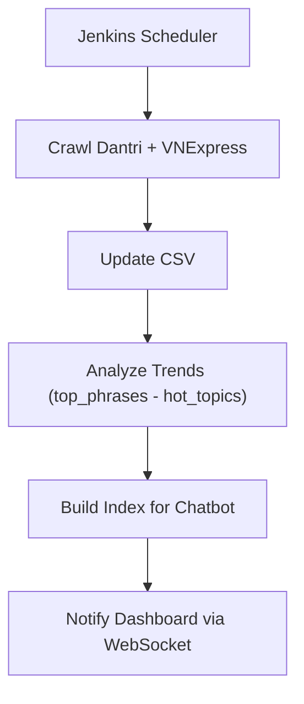

# 🧠 Big Data News Analysis Platform

**Big Data News Analysis Platform** là một hệ thống tổng hợp bao gồm nhiều module hoạt động phối hợp để **crawl tin tức**, **phân tích xu hướng**, **xây dựng chatbot** và **hiển thị dashboard tương tác** từ các nguồn báo điện tử lớn như **Dân Trí** và **VNExpress**. Hệ thống được triển khai theo dạng pipeline tự động, hỗ trợ cập nhật liên tục và realtime.

---

## 🗂️ Cấu trúc thư mục chính

```
.
├── analyze_dantri_trends/    # Phân tích từ khóa và chủ đề báo chí
├── chatbot_rag/              # Chatbot hỏi đáp theo ngữ cảnh (RAG)
├── crawl_dantri/             # Crawler Dân Trí
├── crawl_vnexpress/          # Crawler VNExpress
├── dashboard/                # Giao diện phân tích dữ liệu báo chí
├── .gitignore
└── README.md
```

---

## 🧩 Mô tả các module

### 1. `crawl_dantri/` – Thu thập tin tức từ Dân Trí

- Kết hợp **HTTP Request + BeautifulSoup** và **Selenium Headless**.
- Lưu dữ liệu ra `data.csv`.
- Có hỗ trợ đa luồng và cấu hình động qua `config.py`.

---

### 2. `crawl_vnexpress/` – Thu thập tin tức từ VNExpress

- Cấu trúc tương tự `crawl_dantri`, mỗi chuyên mục (Thời sự, Thế giới, Kinh doanh...) đều có URL riêng.
- Crawler xử lý pagination và lọc duplicate bài viết.
- Lưu dữ liệu ra `data_vnexpress/data.csv`.

---

### 3. `analyze_dantri_trends/` – Phân tích xu hướng báo chí

- Gồm các bước:
  - Tiền xử lý văn bản: chuẩn hóa, tách từ.
  - Trích xuất n-gram và cụm từ phổ biến.
  - Gom nhóm và phân loại chủ đề báo chí.
- Xuất dữ liệu:
  - `top_phrases.json`
  - `hot_topics_<ngày>.csv`

---

### 4. `chatbot_rag/` – Chatbot hỏi đáp theo tài liệu

- Sử dụng **LlamaIndex** kết hợp **embedding tiếng Việt** (`bkai-foundation-models/vietnamese-bi-encoder`).
- Xây dựng index từ dữ liệu tin tức đã crawl.
- Hỗ trợ truy vấn bằng tiếng Việt: "Bài nào nói về chính trị hôm nay?"...

---

### 5. `dashboard/` – Giao diện Streamlit hiển thị báo cáo

- Dashboard realtime gồm:
  - Biểu đồ phân bố chủ đề báo chí.
  - Biểu đồ cụm từ hot (n-gram).
  - Danh sách bài viết nổi bật gần đây.
  - Chatbot tương tác người dùng.
- Hỗ trợ **WebSocket** để tự động reload khi dữ liệu mới được cập nhật.

---

## 🔄 Pipeline realtime với Jenkins

Flow hoạt động mỗi 4 tiếng:




---

## 🧪 Yêu cầu cài đặt

### 1. Cài đặt môi trường Python
```bash
conda create -n bigdata-env python=3.10
conda activate bigdata-env
```

### 2. Cài các thư viện cần thiết
```bash
pip install -r requirements.txt
```

---

## 📌 Tác giả & Đóng góp

- 👨‍💻 **Nhóm nghiên cứu Phân tích Dữ liệu Lớn**
- 🏫 Trường Đại học Phenikaa
- 📬 Mọi góp ý: [GitHub Issues](https://github.com/)

---

## 🛠️ TODOs

- [ ] Hỗ trợ thêm báo Tuổi Trẻ, Zing...
- [ ] Thêm phân tích cảm xúc từ bài báo.
- [ ] Huấn luyện mô hình phân loại topic tùy chỉnh.
- [ ] Tự động tạo báo cáo PDF tuần/tháng.
